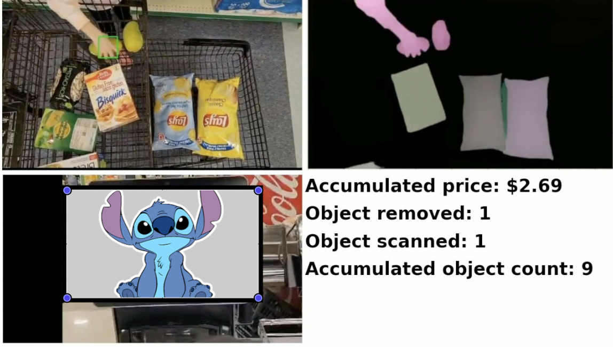
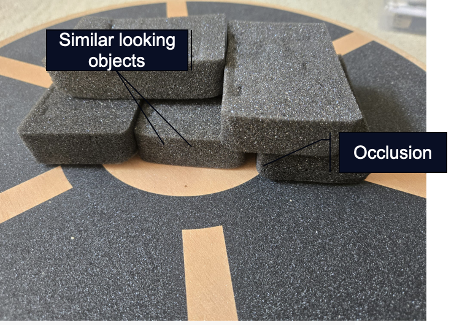

# Real-Time 3D Object Detection and Counting

> A concept and prototype for class-agnostic detection, segmentation, tracking, and counting of objects in containers and other constrained environments.

This repository presents the system design, target use cases, and a recorded demonstration. It is a project showcase; implementation source code is not included.

## Demo

<video src="example.mp4" controls title="Real-time 3D object detection demonstration"></video>

**[Watch the recorded demonstration](example.mp4)**

### Project Example



The example demonstrates the intended retail outcome: segmenting items, tracking scanned and removed objects, maintaining an accumulated count, and updating the total price. The video shows the system operating on a difficult scene containing visually similar objects and partial occlusion.

## The Problem

Conventional object-detection systems can become costly or unreliable when:

- labeled training data is scarce;
- training requires substantial compute and human effort;
- a scene contains many previously unseen object types;
- objects overlap or block one another;
- unrelated objects enter or leave the field of view; or
- objects have nearly identical appearance.



## Proposed Capabilities

The proposed system combines spatial and temporal information to:

- segment objects from their surroundings;
- distinguish and count individual object instances;
- operate without relying on a fixed list of product classes;
- identify foreign objects in the monitored area; and
- track object motion over time.

## Use Cases

### Manufacturing

- Count components or finished goods on conveyor belts.
- Verify quantities during packing and assembly.
- Detect unexpected objects in a production area.

### Inventory and Warehousing

- Monitor incoming and outgoing goods.
- Count items inside bins, totes, or containers.
- Support cycle counts and discrepancy detection.

### Retail

- Monitor shelf stock and trigger replenishment.
- Count products during self-checkout or basket inspection.
- Detect unrecognized or misplaced items.

### Logistics

- Track and count packages at checkpoints.
- Verify container loading and unloading.
- Improve parcel-flow visibility without a model for every package type.

## Repository Structure

```text
.
├── README.md                         # Project overview and use cases
├── example.mp4                      # Recorded outcome demonstration
├── problem.png                      # Annotated challenge/example image
├── image.png                        # Baseline visual-counting example
├── use_case.png                     # Demonstrated project example
└── .gitattributes                   # Git LFS configuration for video
```

## Current Scope

This repository contains presentation and demonstration artifacts only. It does not currently provide training code, inference code, model weights, datasets, benchmarks, or deployment instructions.
